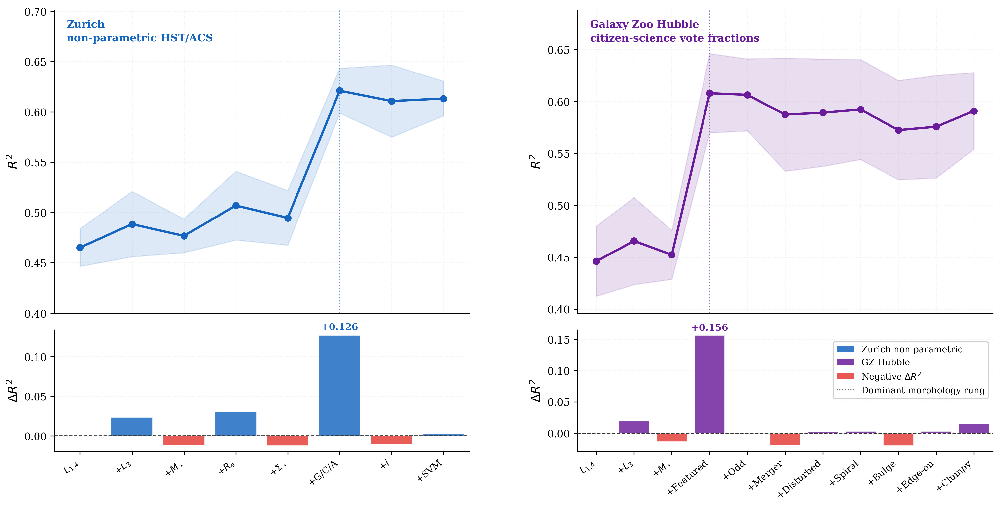

# Structural Information as the Missing Component in the Radio–Star-Formation-Rate Relation

## Authors

- Jason Shingirai Makechemu
- James O. Chibueze
- Brooke D. Simmons

---

## Overview

This repository contains the analysis scripts, machine learning pipelines, figures, notebooks, and supplementary materials associated with our study investigating the role of galaxy structure in the infrared-radio correlation (IRRC) and radio-based star formation rate (SFR) inference.

Using VLA-COSMOS 3 GHz observations, Zurich non-parametric morphology measurements, and Galaxy Zoo Hubble citizen-science classifications, we demonstrate that galaxy morphology is the dominant hidden variable governing scatter in the radio–SFR relation.

---

## Abstract

The infrared-radio correlation carries σ ∼ 0.2–0.3 dex of scatter whose physical origin has remained unidentified. We quantify galaxy structure as the dominant hidden variable using two independent morphology systems applied to 4843 VLA-COSMOS 3 GHz sources.

An information-ladder framework using multilayer perceptron models shows that non-parametric morphology contributes ΔR² = +0.127, a gain substantially larger than all other scalar variables combined. Independent Galaxy Zoo Hubble classifications reproduce the same signal, with the debiased featured/disk vote fraction alone yielding ΔR² = +0.156.

Matched-sample tests show that radio-excess hosts are more compact, smoother, and less disk-dominated than control galaxies at fixed stellar mass, redshift, and SFR. Flat-spectrum radio-excess sources exhibit extreme asymmetry suppression consistent with secular AGN fuelling.

These results demonstrate that morphology is the dominant missing component in radio-based SFR calibration and establish that future radio surveys in the SKA era will require structural information for robust inference.

---

## Example Result



## Key Results

- Non-parametric morphology contributes ΔR² ≈ 0.13
- Galaxy Zoo Hubble classifications independently reproduce the signal
- Morphology is the dominant hidden variable in the radio–SFR relation
- Flat-spectrum radio-excess hosts show strong asymmetry suppression
- Compact, smooth galaxies preferentially host radio excess
- Parametric Sérsic morphology contributes substantially less predictive information
- A single smooth/featured classification captures most of the structural signal

---

## Paper

📄 [Read the preprint PDF](paper/paper.pdf)

---

## Repository Structure

```text
paper/          -> Manuscript PDF and LaTeX source
figures/        -> Figures used in the paper
notebooks/      -> Exploratory analysis notebooks
scripts/        -> Data processing and ML analysis scripts
models/         -> Saved machine learning models
tables/         -> Statistical tables and outputs
data/           -> Processed catalogues and derived products
